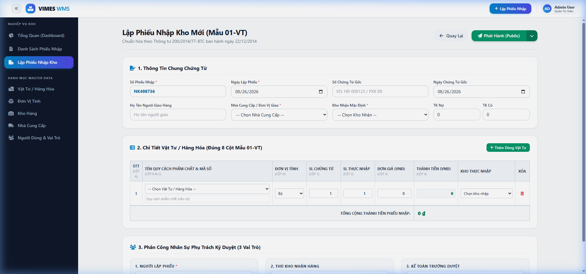
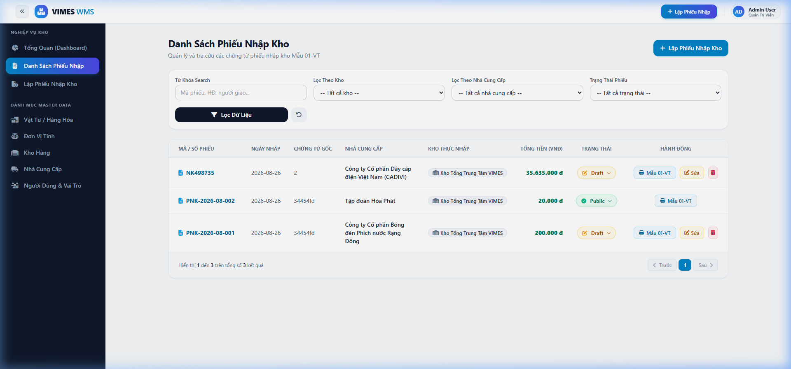
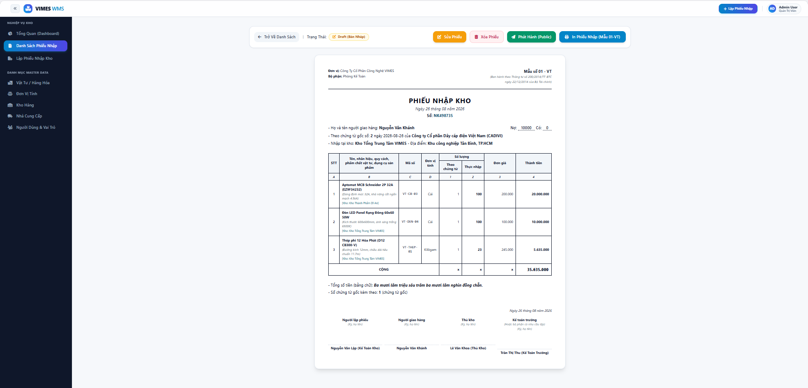
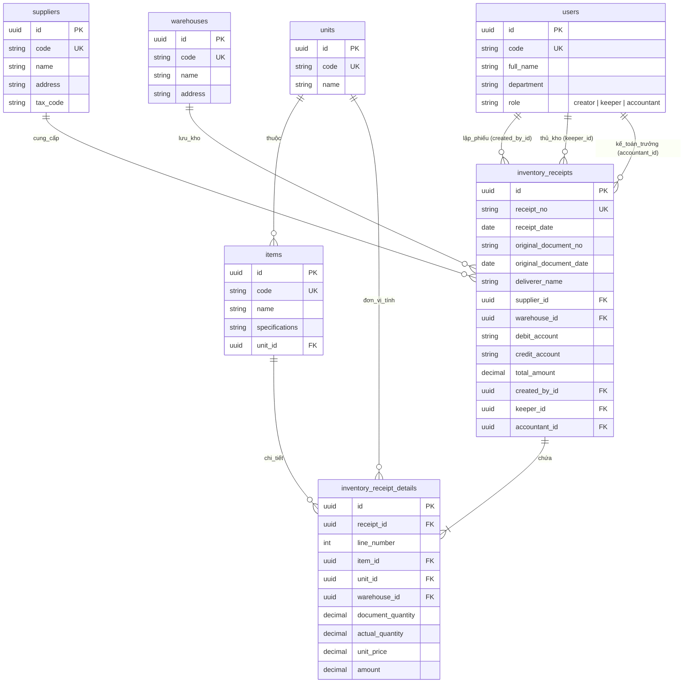

# 📦 Hệ Thống Quản Lý Kho Hàng & Lập Phiếu Nhập Kho (Warehouse Management System - WMS)

> **Hệ thống Quản lý Kho Hàng Chuẩn Mẫu 01-VT** - Giải pháp phần mềm hiện đại được xây dựng trên nền tảng **Node.js, TypeScript, Express, Sequelize ORM và PostgreSQL**, hỗ trợ quản lý danh mục admin data, phân quyền vai trò nhân sự linh hoạt đa kho, và quy trình lập/ký duyệt phiếu nhập kho trực quan.

---

## 🌟 Điểm Nổi Bật Về Kiến Trúc & Nghiệp Vụ

- **Chuẩn Hóa Chứng Từ Mẫu 01-VT**: Hiển thị và in phiếu nhập kho chuẩn 8 cột (STT, Mã & Tên vật tư, Đơn vị tính, Số lượng chứng từ, Số lượng thực nhập, Đơn giá, Thành tiền, Kho thực nhập) kết hợp bộ 3 chữ ký bắt buộc (Người lập, Thủ kho, Kế toán trưởng).
- **Cấu Trúc Route Namespace `/admin/*`**: Đã nâng cấp toàn bộ hệ thống quản lý dữ liệu danh mục nền tảng (Đơn vị tính, Kho hàng, Nhà cung cấp, Vật tư, Người dùng) về namespace quản trị `/admin/*` thống nhất.
- **Phân Quyền Vai Trò Đa Kho (Multi-Warehouse Roles)**: Thiết kế CSDL tối giản, giải phóng ràng buộc cứng `warehouse_id` ở bảng người dùng. Cho phép Người lập (`creator`), Thủ kho (`keeper`), và Kế toán trưởng (`accountant`) linh hoạt ký duyệt và thao tác trên **N nhà kho** khác nhau.
- **Master Data PostgreSQL Phân Trang (Server-side Pagination)**: Tất cả các danh mục Quản lý Đơn vị tính (`units`), Kho hàng (`warehouses`), Nhà cung cấp (`suppliers`), Vật tư/Hàng hóa (`items`), và Người dùng (`users`) được chuyển đổi 100% sang PostgreSQL với tính năng lọc từ khóa & phân trang phía Server.
- **Giao Diện SSR Hiện Đại & Trực Quan**: Render trực tiếp phía Server với EJS, TailwindCSS, hiệu ứng Glassmorphic, micro-animations và Responsive tối ưu cho cả desktop lẫn thiết bị di động.

---

## 🖼 Giao Diện Ứng Dụng (Screenshots)

### 1. Form Lập Phiếu Nhập Kho Mới (Chuẩn Mẫu 01-VT)



### 2. Danh Sách Phiếu Nhập Kho & Tra Cứu Chứng Từ



### 3. Chi Tiết Phiếu Nhập Kho & In Ấn Chứng Từ (Chuẩn Mẫu 01-VT)



---

## 🛠 Công Nghệ Sử Dụng (Technology Stack)

| Thành Phần               | Công Nghệ / Thư Viện    | Mô Tả                                                    |
| :------------------------- | :-------------------------- | :--------------------------------------------------------- |
| **Backend Core**     | Node.js (v18+) & TypeScript | Runtime & Ngôn ngữ lập trình type-safe chuyên nghiệp |
| **Web Framework**    | Express.js (v5)             | RESTful API & Routing Engine                               |
| **Database & ORM**   | PostgreSQL & Sequelize ORM  | Hệ quản trị CSDL quan hệ & ORM chuẩn hóa 3NF         |
| **Migration & Seed** | Sequelize-CLI               | Quản lý phiên bản CSDL, Migration và Data Seeding     |
| **Templating UI**    | EJS (Embedded JavaScript)   | Server-Side Rendering (SSR) giao diện HTML động         |
| **Styling & Icons**  | TailwindCSS & FontAwesome 6 | CSS Framework hiện đại & Icon SVG phong phú            |

---

## 🗄 Sơ Đồ Cơ Sở Dữ Liệu (Mermaid ERD)



---

## 📁 Cấu Trúc Thư Mục Dự Án (Project Structure)

```text
Warehouse Test/
├── config/                  # Cấu hình database & Sequelize CLI
├── database/
│   ├── migrations/          # File migration khởi tạo các bảng PostgreSQL
│   └── seeders/             # File seeder nạp dữ liệu khởi tạo ban đầu
├── docs/
│   └── cores/
│       └── database_design.md  # Tài liệu thiết kế CSDL chi tiết chuẩn 3NF
├── src/
│   ├── config/              # Cấu hình Database & Environment variables
│   ├── models/              # Import & Thiết lập mối quan hệ Sequelize (Associations)
│   ├── modules/
│   │   ├── unit/            # Module Đơn vị tính (Model, DTO, Service, Controller, Views)
│   │   ├── warehouse/       # Module Kho hàng
│   │   ├── supplier/        # Module Nhà cung cấp
│   │   ├── user/            # Module Người dùng & Phân quyền vai trò
│   │   ├── item/            # Module Vật tư / Hàng hóa
│   │   └── receipt/         # Module Lập & Quản lý Phiếu nhập kho (Mẫu 01-VT)
│   ├── public/              # File tĩnh (Javascript client-side, Tailwind styles, Icons)
│   ├── routes/              # Điều hướng chính của ứng dụng Express
│   ├── utils/               # Helper xử lý lỗi (ErrorHandler) & Phân trang (Pagination)
│   ├── views/               # Partial layouts, Header, Navigation Sidebar, Dashboard
│   └── server.ts            # Entrypoint ứng dụng Express Server
├── .env                     # Biến môi trường CSDL PostgreSQL & Cấu hình App
├── package.json
└── tsconfig.json
```

---

## 🚀 Hướng Dẫn Cài Đặt & Khởi Chạy (Getting Started)

### 1. Yêu Cầu Tiền Đề (Prerequisites)

- **Node.js**: v18.0.0 trở lên
- **PostgreSQL**: v14.0 trở lên (đang chạy service trên localhost hoặc kết nối từ xa)

### 2. Cấu Hình Biến Môi Trường (`.env`)

Tạo file `.env` tại thư mục gốc với các thông số kết nối PostgreSQL:

```env
PORT=3000
NODE_ENV=development
COMPANY_NAME=Công Ty Cổ Phần Công Nghệ VIMES

DB_HOST=localhost
DB_PORT=5432
DB_NAME=warehouse_db
DB_USER=postgres
DB_PASSWORD=postgres
```

### 3. Cài Đặt Dependencies

```bash
npm install
```

### 4. Thực Thi Migration & Seed Dữ Liệu Mẫu vào PostgreSQL

Khởi tạo cấu trúc các bảng trong cơ sở dữ liệu:

```bash
npm run migrate
```

Nạp dữ liệu danh mục mẫu (Đơn vị tính, Kho hàng, Nhà cung cấp, Vật tư, Người dùng):

```bash
npm run seed
```

### 5. Chạy Ứng Dụng ở Chế Độ Development

```bash
npm run dev
```

Ứng dụng sẽ chạy tại địa chỉ: **`http://localhost:3000`**

---

## 📖 Các Lệnh Scripts Hỗ Trợ (Available NPM Scripts)

| Lệnh Script             | Công Dụng                                                                      |
| :----------------------- | :------------------------------------------------------------------------------- |
| `npm run dev`          | Khởi chạy server ở chế độ Development với Hot-reload (`tsx watch`)      |
| `npm run build`        | Biên dịch TypeScript sang mã JavaScript nguyên bản trong thư mục`dist/` |
| `npm run start`        | Chạy sản phẩm đã biên dịch trong thư mục`dist/server.js`              |
| `npm run migrate`      | Thực thi tất cả các file Migration khởi tạo bảng PostgreSQL               |
| `npm run migrate:undo` | Rollback Migration gần nhất                                me                  |
| `npm run seed`         | Thực thi toàn bộ các file Seeder nạp dữ liệu mẫu                         |
| `npm run seed:undo`    | Rollback Seeder gần nhất                                                       |

---

## 📜 Các Tính Năng & Route Chính

- **Trang Chủ & Dashboard**: `GET /` - Tổng quan thống kê số liệu phiếu nhập, vật tư, kho hàng và nhà cung cấp.
- **Danh Mục Quản Trị Admin (Admin Namespace)**:
  - **Đơn Vị Tính**: `GET /admin/units` - Thêm, sửa, xóa, tìm kiếm & phân trang Đơn vị tính.
  - **Kho Hàng**: `GET /admin/warehouses` - Quản lý thông tin nhà kho vật lý & địa điểm.
  - **Nhà Cung Cấp**: `GET /admin/suppliers` - Quản lý danh sách nhà cung cấp & mã số thuế.
  - **Vật Tư / Hàng Hóa**: `GET /admin/items` - Quản lý mã, tên vật tư, quy cách và đơn vị tính liên kết.
  - **Người Dùng & Vai Trò**: `GET /admin/users` - Quản lý nhân sự và phân quyền 3 vai trò (`creator`, `keeper`, `accountant`).
- **Quản Lý Phiếu Nhập Kho (Mẫu 01-VT)**:
  - `GET /receipts` - Danh sách phiếu nhập kho có lọc tìm kiếm & phân trang.
  - `GET /receipts/create` - Form lập phiếu nhập kho mới chuẩn Mẫu 01-VT.
  - `GET /receipts/:id` - Xem chi tiết phiếu nhập kho & in ấn chứng từ.
  - `GET /receipts/:id/edit` - Chỉnh sửa phiếu nhập kho (trạng thái DRAFT).

---
