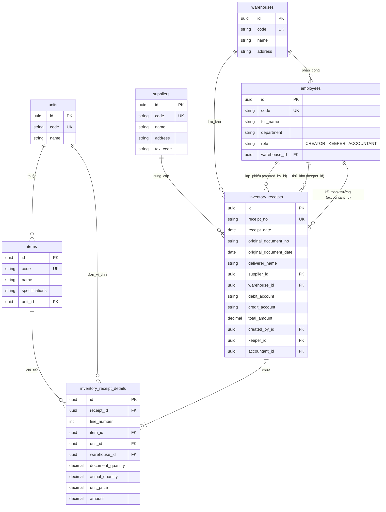

# BẢN THIẾT KẾ CƠ SỞ DỮ LIỆU TỐI GIẢN & CHUẨN HÓA (OPTIMIZED WMS DB)

---

## 1. TỔNG QUAN HỆ THỐNG THIẾT KẾ TỐI GIẢN

Hệ thống được thiết kế tối giản, loại bỏ mọi trường dữ liệu dư thừa, đảm bảo chuẩn 3NF và phân định rõ **3 Vai trò Nhân sự** cũng như **Tách biệt Header / Detail 8 cột**:

1. **5 Bảng Danh mục Master**:
   - `units`: Đơn vị tính.
   - `suppliers`: Nhà cung cấp.
   - `warehouses`: Kho hàng (Chỉ chứa thông tin nhà kho vật lý: Mã kho, Tên kho, Địa điểm).
   - `employees`: Nhân viên / Con người (Chứa Họ tên, Chức vụ/Vai trò và địa điểm kho công tác).
   - `items`: Vật tư / Hàng hóa.

2. **2 Bảng Giao dịch Phiếu Nhập**:
   - `inventory_receipts` (Header): Thông tin chung phiếu nhập (Số phiếu, Ngày nhập, Chứng từ gốc, Nợ/Có, Người lập, Thủ kho).
   - `inventory_receipt_details` (Detail): Đúng **8 CỘT** Mẫu 01-VT (STT, Mã & Tên vật tư, Đơn vị tính, Số lượng chứng từ, Số lượng thực nhập, Đơn giá, Thành tiền, Kho thực nhập).

---

## 2. SƠ ĐỒ LIÊN KẾT CHUẨN (MERMAID ERD FULL TRƯỜNG)



---

## 3. BẢNG THÔNG SỐ CHI TIẾT CÁC TRƯỜNG DỮ LIỆU (DATA DICTIONARY)

### 3.1. Bảng `units` (Đơn vị tính)
| Tên Trường | Kiểu Dữ Liệu | Ràng Buộc | Mô Tả |
| :--- | :--- | :--- | :--- |
| `id` | UUID | PK, DEFAULT uuid_generate_v4() | Mã định danh duy nhất |
| `code` | VARCHAR(20) | UNIQUE, NOT NULL | Mã đơn vị tính (VD: KG, CAI, MET) |
| `name` | VARCHAR(50) | NOT NULL | Tên đơn vị tính (VD: Kilôgam, Cái, Mét) |

---

### 3.2. Bảng `suppliers` (Nhà cung cấp)
| Tên Trường | Kiểu Dữ Liệu | Ràng Buộc | Mô Tả |
| :--- | :--- | :--- | :--- |
| `id` | UUID | PK, DEFAULT uuid_generate_v4() | Mã định danh duy nhất |
| `code` | VARCHAR(50) | UNIQUE, NOT NULL | Mã nhà cung cấp |
| `name` | VARCHAR(255) | NOT NULL | Tên nhà cung cấp |
| `address` | VARCHAR(255) | NULL | Địa chỉ nhà cung cấp |
| `tax_code` | VARCHAR(20) | NULL | Mã số thuế |

---

### 3.3. Bảng `warehouses` (Kho hàng)
| Tên Trường | Kiểu Dữ Liệu | Ràng Buộc | Mô Tả |
| :--- | :--- | :--- | :--- |
| `id` | UUID | PK, DEFAULT uuid_generate_v4() | Mã định danh duy nhất |
| `code` | VARCHAR(50) | UNIQUE, NOT NULL | Mã kho |
| `name` | VARCHAR(255) | NOT NULL | **Tên kho** (Hiển thị ô "Nhập tại kho" Mẫu 01-VT) |
| `address` | VARCHAR(255) | NULL | **Địa điểm kho** (Hiển thị ô "Địa điểm" Mẫu 01-VT) |

---

### 3.4. Bảng `employees` (Nhân viên / Người dùng)
| Tên Trường | Kiểu Dữ Liệu | Ràng Buộc | Mô Tả |
| :--- | :--- | :--- | :--- |
| `id` | UUID | PK, DEFAULT uuid_generate_v4() | Mã định danh duy nhất |
| `code` | VARCHAR(50) | UNIQUE, NOT NULL | Mã nhân viên |
| `full_name` | VARCHAR(100) | NOT NULL | Họ và tên nhân viên |
| `department` | VARCHAR(100) | NULL | Phòng ban |
| `role` | VARCHAR(50) | NOT NULL, CHECK | **3 Vai trò**: `'CREATOR'` (Người lập), `'KEEPER'` (Thủ kho), `'ACCOUNTANT'` (Kế toán trưởng) |
| `warehouse_id` | UUID | FK -> `warehouses` | Kho phụ trách (Phân công nhân sự theo Kho) |

---

### 3.5. Bảng `items` (Vật tư / Hàng hóa)
| Tên Trường | Kiểu Dữ Liệu | Ràng Buộc | Mô Tả |
| :--- | :--- | :--- | :--- |
| `id` | UUID | PK, DEFAULT uuid_generate_v4() | Mã định danh duy nhất |
| `code` | VARCHAR(50) | UNIQUE, NOT NULL | **Cột C (Mã số)** trên Mẫu 01-VT |
| `name` | VARCHAR(255) | NOT NULL | **Cột B (Tên vật tư)** trên Mẫu 01-VT |
| `specifications` | TEXT | NULL | **Cột B (Quy cách, phẩm chất)** trên Mẫu 01-VT |
| `unit_id` | UUID | FK -> `units`, NOT NULL | **Cột D (Đơn vị tính)** trên Mẫu 01-VT |

---

> [!NOTE]
> **Ánh xạ 2 dòng góc trên bên trái Mẫu 01-VT**:
> * **`Đơn vị`**: Tên Công ty / Chi nhánh sở hữu hệ thống (Lấy từ Cấu hình hệ thống `.env` hoặc Cấu hình Doanh nghiệp: `COMPANY_NAME = "Công ty VIMES"`).
> * **`Bộ phận`**: Phòng ban của Người lập phiếu hoặc Bộ phận yêu cầu nhập kho (Lấy từ `employees.department` của `created_by_id`).

---

### 3.6. Bảng `inventory_receipts` (Header Phiếu Nhập Kho)
| Tên Trường | Kiểu Dữ Liệu | Ràng Buộc | Mô Tả (Ánh xạ Mẫu 01-VT) |
| :--- | :--- | :--- | :--- |
| `id` | UUID | PK | Khóa chính |
| `receipt_no` | VARCHAR(50) | UNIQUE, NOT NULL | **Số phiếu nhập** |
| `receipt_date` | DATE | NOT NULL, DEFAULT CURRENT_DATE | **Ngày lập phiếu** |
| `original_document_no` | VARCHAR(100) | NULL | **Số chứng từ gốc** |
| `original_document_date` | DATE | NULL | **Ngày chứng từ gốc** |
| `deliverer_name` | VARCHAR(100) | NULL | **Họ và tên người giao hàng** |
| `supplier_id` | UUID | FK -> `suppliers` | Nhà cung cấp giao hàng |
| `warehouse_id` | UUID | FK -> `warehouses` | **Kho nhận mặc định** |
| `debit_account` | VARCHAR(20) | NULL | **Tài khoản Nợ** (VD: 152) |
| `credit_account` | VARCHAR(20) | NULL | **Tài khoản Có** (VD: 331) |
| `total_amount` | NUMERIC(18,2) | DEFAULT 0, CHECK >= 0 | **Tổng số tiền phiếu** |
| `created_by_id` | UUID | FK -> `employees`, NOT NULL | **Người lập phiếu (Ký, họ tên)** (`role = 'CREATOR'`) |
| `keeper_id` | UUID | FK -> `employees` | **Thủ kho (Ký, họ tên)** (`role = 'KEEPER'`) |
| `accountant_id` | UUID | FK -> `employees` | **Kế toán trưởng (Ký, họ tên)** (`role = 'ACCOUNTANT'`) |
| `created_at` | TIMESTAMPTZ | DEFAULT CURRENT_TIMESTAMP | Thời gian tạo trên hệ thống |

---

### 3.7. Bảng `inventory_receipt_details` (Detail - Đúng 8 Cột Mẫu 01-VT)
| Tên Trường | Kiểu Dữ Liệu | Ràng Buộc | Mô Tả (Ánh xạ Mẫu 01-VT) |
| :--- | :--- | :--- | :--- |
| `id` | UUID | PK | Khóa chính dòng |
| `receipt_id` | UUID | FK -> `inventory_receipts`, NOT NULL | Khóa ngoại trỏ tới Header (ON DELETE CASCADE) |
| `line_number` | INT | NOT NULL | **Cột A**: STT dòng (1, 2, 3...) |
| `item_id` | UUID | FK -> `items`, NOT NULL | **Cột B & C**: Mã số & Tên quy cách vật tư |
| `unit_id` | UUID | FK -> `units`, NOT NULL | **Cột D**: Đơn vị tính |
| `document_quantity` | NUMERIC(12,3) | NOT NULL, CHECK >= 0 | **Cột 1**: Số lượng theo chứng từ |
| `actual_quantity` | NUMERIC(12,3) | NOT NULL, CHECK >= 0 | **Cột 2**: Số lượng thực nhập |
| `unit_price` | NUMERIC(18,2) | NOT NULL, CHECK >= 0 | **Cột 3**: Đơn giá |
| `amount` | NUMERIC(18,2) | GENERATED ALWAYS AS (...) | **Cột 4**: Thành tiền (`actual_quantity * unit_price`) |
| `warehouse_id` | UUID | FK -> `warehouses` | Kho thực nhập (Dùng cho Nhập đa kho) |

---

## 4. SQL DDL KHỞI TẠO CƠ SỞ DỮ LIỆU TỐI GIẢN

```sql
CREATE EXTENSION IF NOT EXISTS "uuid-ossp";

-- 1. Bảng Đơn vị tính
CREATE TABLE units (
    id UUID PRIMARY KEY DEFAULT uuid_generate_v4(),
    code VARCHAR(20) NOT NULL UNIQUE,
    name VARCHAR(50) NOT NULL
);

-- 2. Bảng Kho hàng (Tên kho & Địa điểm)
CREATE TABLE warehouses (
    id UUID PRIMARY KEY DEFAULT uuid_generate_v4(),
    code VARCHAR(50) NOT NULL UNIQUE,
    name VARCHAR(255) NOT NULL,
    address VARCHAR(255)
);

-- 3. Bảng Nhà cung cấp
CREATE TABLE suppliers (
    id UUID PRIMARY KEY DEFAULT uuid_generate_v4(),
    code VARCHAR(50) NOT NULL UNIQUE,
    name VARCHAR(255) NOT NULL,
    address VARCHAR(255),
    tax_code VARCHAR(20)
);

-- 4. Bảng Nhân viên (Phân 3 vai trò rõ ràng & Gắn theo Kho)
CREATE TABLE employees (
    id UUID PRIMARY KEY DEFAULT uuid_generate_v4(),
    code VARCHAR(50) NOT NULL UNIQUE,
    full_name VARCHAR(100) NOT NULL,
    department VARCHAR(100),
    role VARCHAR(50) NOT NULL CHECK (role IN ('CREATOR', 'KEEPER', 'ACCOUNTANT')),
    warehouse_id UUID REFERENCES warehouses(id) -- Kho phụ trách
);

-- 5. Bảng Vật tư / Hàng hóa
CREATE TABLE items (
    id UUID PRIMARY KEY DEFAULT uuid_generate_v4(),
    code VARCHAR(50) NOT NULL UNIQUE,
    name VARCHAR(255) NOT NULL,
    specifications TEXT,
    unit_id UUID NOT NULL REFERENCES units(id)
);

-- 6. Bảng Header Phiếu nhập kho (Tối giản 2 chữ ký bắt buộc)
CREATE TABLE inventory_receipts (
    id UUID PRIMARY KEY DEFAULT uuid_generate_v4(),
    receipt_no VARCHAR(50) NOT NULL UNIQUE,
    receipt_date DATE NOT NULL DEFAULT CURRENT_DATE,
    original_document_no VARCHAR(100),
    original_document_date DATE,
    deliverer_name VARCHAR(100),
    supplier_id UUID REFERENCES suppliers(id),
    warehouse_id UUID REFERENCES warehouses(id), -- Kho nhận mặc định
    debit_account VARCHAR(20),
    credit_account VARCHAR(20),
    total_amount NUMERIC(18, 2) DEFAULT 0 CHECK (total_amount >= 0),
    created_by_id UUID NOT NULL REFERENCES employees(id), -- 1. Người lập (role = 'CREATOR')
    keeper_id UUID REFERENCES employees(id),              -- 2. Thủ kho nhận (role = 'KEEPER')
    accountant_id UUID REFERENCES employees(id),    -- 3. Kế toán trưởng duyệt (role = 'ACCOUNTANT')
    created_at TIMESTAMPTZ DEFAULT CURRENT_TIMESTAMP
);

-- 7. Bảng Detail (Chi tiết 8 cột + Hỗ trợ Nhập đa kho)
CREATE TABLE inventory_receipt_details (
    id UUID PRIMARY KEY DEFAULT uuid_generate_v4(),
    receipt_id UUID NOT NULL REFERENCES inventory_receipts(id) ON DELETE CASCADE,
    line_number INT NOT NULL,
    item_id UUID NOT NULL REFERENCES items(id),
    unit_id UUID NOT NULL REFERENCES units(id),
    warehouse_id UUID REFERENCES warehouses(id), -- Kho thực nhập từng dòng
    document_quantity NUMERIC(12, 3) NOT NULL CHECK (document_quantity >= 0),
    actual_quantity NUMERIC(12, 3) NOT NULL CHECK (actual_quantity >= 0),
    unit_price NUMERIC(18, 2) NOT NULL CHECK (unit_price >= 0),
    amount NUMERIC(18, 2) GENERATED ALWAYS AS (actual_quantity * unit_price) STORED,
    CONSTRAINT uk_receipt_line_number UNIQUE (receipt_id, line_number)
);
```
